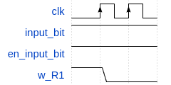
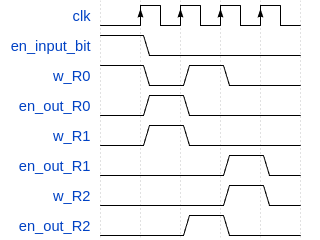
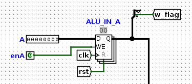
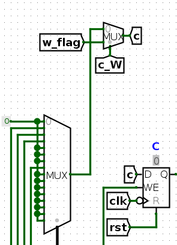
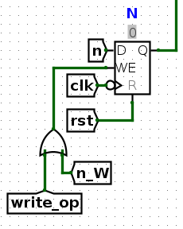

# Aclaraciones
Hemos creado nuevos microCodes, assemblys y buildMicroOps para el ej4 y el ej5. Es decir que dentro de cada carpeta de esos ejercicios se encontrarán las herramientas pertinentes a ese ejercicio. El ejercicio 3 utiliza el assembler original, por lo que no tiene herramientas propias.

Es importante saber también que en la carpeta ej5 hay otra carpeta para el punto b, en la que se creó un nuevo microCode y assembler con los saltos modificados.

Por último, el common del ejercicio 5 fue modificado para poder parsear las instrucciones de tipo F, que no reciben ningún parámetro (escritura y lectura de flags).

# Respuestas enunciados
## Ejercicio 1
__a)__ Las entradas son:
* input_bit: Es el bit de entrada que puede ser almacenado en uno o varios registros (R0, R1, R2).
* en_input_bit: Es la señal de control que controla la impedancia del input_bit. Es decir que controla si el input_bit pasa o no al bus.
* clk: En el sistema, es una señal periódica (reloj del sistema) que controla el momento en que se actualizan los valores almacenados en los registros. Es decir si se almacena o no el bit del bus. En los flancos ascendentes (cuando pasa a valer 1) se realizan los cambios correspondientes a las entradas actuales.
* w: Son tres entradas, una por cada registro. Controla si el bit del bus se escribe en el registro.
* en_out: Son tres entradas, una por cada registro. Controla si el bit almacenado en el registro sale al bus.
Las salidas son:
* R0, R1, R2: Es el bit almacenado en cada registro, que puede salir al bus si la señal de control en_out está prendida.
* Salida del bus (sin nombre en el componente): Es la salida del bit del bus. Ese bit puede ser el de input_bit cuando en_input_bit está prendido, o el de algún registro si su flag en_out correspondiente está prendida (da error si hay dos bits distintos en el bus al mismo tiempo).
Las entradas de control son en_input_bit, clk, w, en_out.

__b)__ 
```
input_bit en_input_bit R1_w
R1_w=0
```


__c)__

``` 
en_input_bit R0_w

en_out_R0 w_R1

en_out_R2 w_R0

en_out_R1 w_R2
```




### OrgaSmall - Análisis
__a)__ El tamaño de la memoria es de 256 bytes (256 palabras de 8 bits).

__b)__ El tamaño del PC es de un registro de 1 byte (1 palabra de 8 bits).

__c)__ Dado que disponemos de 5 bits para el CodOp (los 5 primeros de la instrucción, que consta de 16 bits), que define la instrucción, podríamos definir 32 instrucciones (2**5), pero dado que tenemos 22 instrucciones declaradas, queda espacio para agregar 10 instrucciones nuevas respetando el formato. 

### Mirando los módulos indicados de hardware
__a)__ La señal inc se encarga de incrementar en 1 el inData que le llega al PC, para buscar la próxima instrucción del programa a la memoria.

__b)__ La señal opW es una entrada de control que se encarga de permitir o bloquear la salida de las flags Z C N correspondientes a la operación actual de la ALU.

__c)__ La señal DE_enOutImm se encarga de habilitar el paso de un valor inmediato o dirección de memoria al bus. Esto se da en las instrucciones de formato C y D, y el valor inmediato ocupa los últimos 8 bits de la instrucción. El registro que se va a leer o escribir está determinado por el indexX y el indexY que salen del Decode, y luego el ControlUnit, a través de la flag RB_selectIndexIn selecciona qué registro se quiere leer, si el que se encuentra en el indexX o el indexY a través de un Multiplexor, y de la misma forma, con la flag RB_selectIndexOut, selecciona qué registro se quiere leer, según la instrucción que corresponda.

__d)__ El mecanismo para resolver los saltos condicionales (JC, JN, JZ) es el siguiente:

___1.___ Las flags jc_microOp, jz_microOp, jn_microOp indican si se quiere realizar un salto condicional (jc de acuerdo al flag C, jz al Z y jn al N). Luego hay otra entrada "flags" que consta de tres bits: uno por cada flag C, Z y N. Cada entrada de control de salto entra a una compuerta AND con la flag correspondiente al salto (por ejemplo, jc_microOp entra a una compuerta AND con el bit menos significativo de la entrada flags, que corresponde al carry C).

___2.___ Las tres salidas de las compuertas AND entran a una compuerta OR. De esta manera, si se quiso realizar un salto condicional y su flag correspondiente está prendida, va a salir un 1 de esa compuerta AND, y de la OR también saldrá un 1.

___3.___ El bit que sale de la compuerta OR entra como bit de selección a un Multiplexor. Este Multiplexor tiene dos entradas: en la entrada 0 la dirección que pasó por el MicroPC, la de la instrucción JC, JN o JZ (completada con 4 ceros, que son los que luego se van incrementando por cada microninstrucción) incrementada en uno, o, en la entrada 1, la misma dirección incrementada en dos. Ambos incrementos son realizados con un sumador al que entra la dirección con una constante uno o dos según corresponda.

___4.___ Las tres flags de los saltos entran a una compuerta OR, y el bit de salida va como entrada de control a otro Multiplexor. En este Multiplexor entra un OpCode completado con ceros, y también entra la salida del Multiplexor indicado en el paso ___3___. Si el bit que sale de la OR es 1, sale del Multiplexor la dirección de la microinstrucción incrementada en 1 o en 2 (recordemos que este incremento respondía a si se cumplía o no el salto condicional), y si es 0 sale el OpCode. La salida de este Multiplexor entra al microPC.

___5.___ Para entender por qué el circuito es así, veamos primero el formato de un salto condicional, poniendo como ejemplo las microinstrucciones de un JC (el de JN y JZ son iguales pero cambiando la primera etiqueta según corresponda):

```
JC_microOp load_microOp
reset_microOp
DE_enOutImm PC_load
reset_microOp 
```

Como vemos, en la primera instrucción se prende la flag que indica qué salto condicional queremos hacer, lo que va a causar que salga un 1 de la compuerta OR del paso ___4___. Si no se cumple el salto, sale un 0 de la compuerta AND correspondiente al salto condicional, haciendo que el bit del paso ___3___ sea 0, por lo que se carga al microPC la dirección de microinstrucción incrementada en 1.

Al incrementar en 1 esta dirección, se pasa a la microinstrucción reset_microOp, lo que nos devuelve al fetch. Esto quiere decir que no se cumplió el salto condicional, por lo que se pasa a la siguiente instrucción del programa.

En cambio, si se cumple el salto, la dirección de la microinstrucción siguiente se va a incrementar en 2, pasando a la línea "DE_enOutImm PC_load", es decir que cargamos en el PC un valor inmediato que nos lleva a otra instrucción, y cuando se haga el reset_microOp de la última línea y se vaya al fetch, la próxima instrucción será la correspondiente al DE_enOutImm que cargamos en el PC. Es decir que se cumplió el salto condicional y se hizo el salto que queríamos en el programa.

## Ejercicio 3

__a)__ Pasos de ejecución:

___1.___ Se realiza un salto a la etiqueta seguir.

___2.___ Se carga el valor 0xFF (-1) en el registro 0, y el valor 0x11 (17) en el registro 1.

___3.___ Se pasa a la etiqueta siguiente.

___4.___ Se realiza una suma entre el valor alojado en el registro 0 y el del registro 1, y el resultado se guarda en el registro 0.

___5.___ Si la suma del paso anterior tenía Carry, se realiza un salto a la etiqueta siguiente, y se vuelve a realizar la suma con los nuevos valores.

___6.___ Si la suma no tiene Carry, se pasa a la etiqueta halt.

___7.___ Se realiza un salto a la etiqueta halt, lo que da inicio a un loop que representa el final del programa.

__b)__ Posición de cada instrucción (en bytes):

_JMP seguir_: 00

_SET R0, 0xFF_: 02

_SET R1, 0x11_: 04

_ADD R0, R1_: 06

_JC siguiente_: 08

_JMP halt_: 0A

Dado que la etiqueta __seguir__ indica la dirección de memoria de la instrucción _SET R0, 0xFF_, su valor será 02 (0010).
De la misma manera, la etiqueta __siguiente__ nos indica la dirección de memoria de la instrucción _ADD R0, R1_, por lo que su valor será 06 (0110).
Por último, la etiqueta __halt__ nos indica la dirección de memoria de la instrucción _JMP halt_, por lo que su valor será 0A (1010).

__c)__ Para que el código llegue a la instrucción JMP halt son necesarios 53 ciclos de clock.

__d)__ Para el ADD son necesarias 5 microinstrucciones, las siguientes:

```
    RB_enOut  ALU_enA  RB_selectIndexOut=0
    RB_enOut  ALU_enB  RB_selectIndexOut=1
    ALU_OP=ADD ALU_opW
    RB_enIn   ALU_enOut RB_selectIndexIn=0
    reset_microOp
```

Por su parte, para el JMP son necesarias 2 instrucciones:

```
    PC_load DE_enOutImm
    reset_microOp
```

## Ejercicio 5

__e)__ Para la instrucción de escribir una flag, se agregaron 3 señales en la ControlUnit: c_W, z_W y n_W, que se utilizan como entradas en la ALU, y habilitan la escritura de c, z y n respectivamente. Esa escritura se realiza en la ALU, utilizando el bit menos significativo de la entrada A. Si se quiere prender la flag entra en A la cte 01 y si se quiere poner en 0, entra en A la cte 00.



Vamos a ver cómo funciona el circuito para una flag arbitraria, ya que se hace lo mismo para las 3.

Primero tenemos un Multiplexor que tiene como bit de selección la entrada de control x_W (con x = z, n, c). Al Multiplexor entra el bit menos significativo de A a la posición 1 (el que dijimos antes que se escribe en la flag), y a la posición 0 entra el bit original de la flag, el que corresponde a cada operación de la ALU. Este Multiplexor se puso antes del registro de la flag, por lo que el valor que se escriba se va a guardar. Veamos esta parte del circuito para la flag c.



Por último, añadimos una compuerta OR a la que entran x_W y opW, tal que el write enable del registro de la flag se puede prender individualmente con x_W, o con el opW.



Por su parte, para la lectura, simplemente tomamos la salida de las flags en la ALU, la completamos con ceros en los bits más significativos, y agregamos esa salida como una nueva operación de la ALU. De esta forma, si queremos almacenar las flags en un registro (serían 8 bits con los 3 bits menos significativos para las flags, en orden n-z-c), simplemente llamamos a la operación READ_F de la ALU y almacenamos la salida en algun registro.